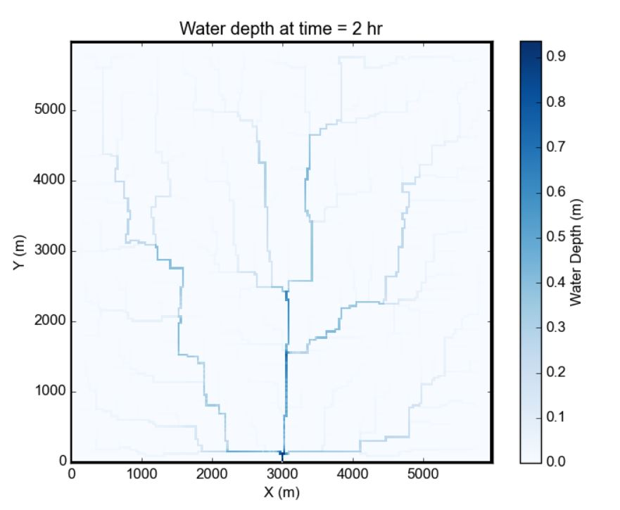

# Particle_Flow_Coupling

#### This project integrates the Overland Flow simulation model with the Dorado Particle Tracking Flow model. These two models, traditionally independent, have been coupled to enhance efficiency and usability in our use case. By combining the strengths of Overland Flow's hydrodynamic simulations and Dorado's particle tracking capabilities, we provide a comprehensive tool for more accurate and streamlined environmental modeling.

Figure 1: Map of water depths at time = 2 hr, for the sample storm on the square basin (5 mm/hr over duration of 2 hr). (Source: https://landlab.readthedocs.io/en/latest/user_guide/overland_flow_user_guide.html)

The Landlab OverlandFlow component implements a 2-D solution of the shallow water equations, following the algorithm of de Almeida et al., (2012). 

Figure 2: Visualization of result after running dorado model. (Source: https://passah2o.github.io/dorado/)

Dorado is a python package developed to simulate the transport of passive particles in a flow field. Particle movement is simulated in a Lagrangian fashion using a weighted random walk formulation.